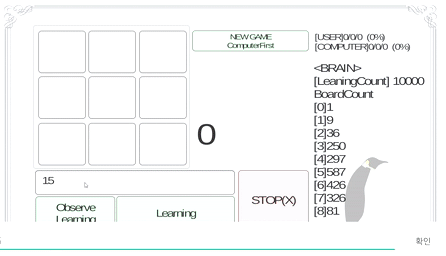
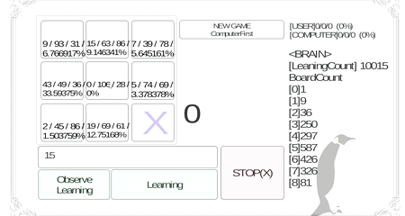

  
  

 

<h3 align="center">TicTacToe AI</h3>

---

 Simple TicTacToe AI Simulator. Only core sources exist.
      

## 📝 Table of Contents

- [Getting Started](#getting_started)
- [Acknowledgments](#acknowledgement)

## 🏁 Getting Started 

### 🚀 Installing

1. **install and execute `tictactoe_ai.apk` on Android OS.**

1. **Learning**

    

1. **Battle**

    

## 🎉 Acknowledgements 

- Title icon made by [Freepik](https://www.flaticon.com/kr/authors/freepik).

- If you have a problem. please make [issue](https://github.com/da-huin/tictactoe_ai/issues).

- Please help develop this project 😀

- Thanks for reading 😄
